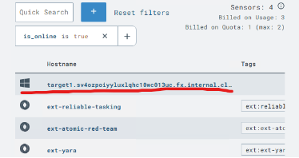
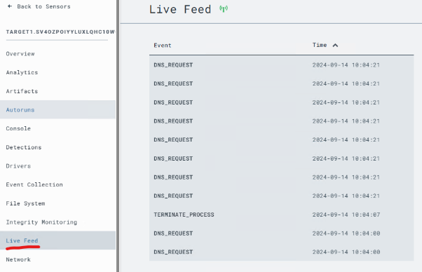

# Setup Instructions

## Connecting to the virtual machine

- 1. Remote Connection

   - Windows:
      
      Open RDP and enter the public ip:

      

   - Mac:

      Windows App is recommended to download for remote desktop control

- 2. Connect to C2 Server (attack machine):

   - 2.1 Login with the credentials via <https://127.0.0.1:7443/new/login> (credential exists in .env)

      **attack machine:**

      This virtual machine is used to host the c2 server (exfiltrating data)

      Using Mythic (C2 server):

   - 2.2 Download Potential Payloads suitable for different operating systems

      - Windows
        ```
         1. login in Mythic, create payload
         2. use apollo to create exe file
         3. choose default payload function (do not contain all functions, some are not available on Windows)
         4. set the callback host with http://{attack_machine_public_ip}, this ip is not the ip shown locally with ifconfig
         5. create and download, scp to target Windows machine, click for exeuction
         ```

      - Linux
         ```
         
         ```

   - 2.3 After successfully running on target machine, navigate to the active callback page to see the callback hosts and exfiltrated data.


## Monitoring Machine:

   Using Lima Charlie (Log monitoring):

   [A Public Cloud for SecOps | LimaCharlie](https://limacharlie.io/)

   -  1. Login with the credentials

   -  2. Once logged in you can observe the logs coming through on the target machine by navigating below

      - 2.1 Starting on [Orgs - LimaCharlie](https://app.limacharlie.io/orgs)

      - 2.2 Click on the organization displayed here 
         
         

      - 2.3 Then on the sensor

         

      - 2.4 Then to see the windows logs on this machine click on Live feed in the left side bar

         

## Configuration on Victim Machine:

   - Turn off defender real time protection:

   


   - How to exfiltrate data:

   - 1. Using a payload with the medusa payload type 

   - 2. Included the data to exfiltrate in the data dictionary of the payload, run the python file to exfiltrate data and check the data in the active callback window 

   

   
