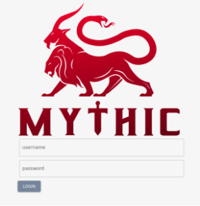
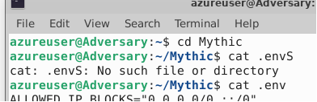
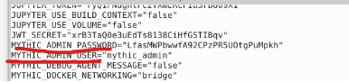
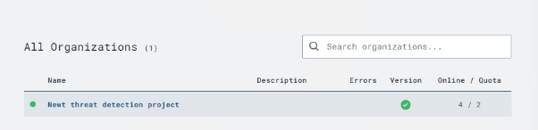
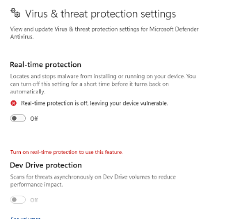
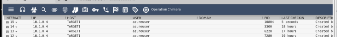

# Setup Instructions

**Connecting to the virtual machine:**

- 1. Open RDP and enter the public ip of each virtual machine (this can be found in azure) and press connect

   

- 2. Connect to C2 Server (attack machine):

   - 2.1 Login with the credentials (username): azureuser (password): TaylorBrierley01

      **attack machine:**

      This virtual machine is used to host the c2 server (exfiltrating data)

      Using Mythic (C2 server):

   - 2.2 Enter the url <https://127.0.0.1:7443/new/login> in the url bar:

      
      
      You will be brought to a login page

      (If this doesn’t resolve, docker is down, follow the first part of this video <https://www.youtube.com/watch?v=QmC1zhpTxww&ab_channel=Lsecqt> to start it up again).

   - 2.3 Enter the commands
      
      

   - 2.4 Find the credentials to log in
      
       

   - 2.5 Once you see the c2 server dashboard you can navigate to the active callback page to see the callbacks and exfiltrated data from run scripts (payloads).

**Monitoring Machine:**

   Using Lima Charlie (Log monitoring):

   [A Public Cloud for SecOps | LimaCharlie](https://limacharlie.io/)

   -  1. Login with the credentials (email): <taylor.brierley@jumpsec.com> (Password): TaylorBrierley#0101 

   -  2. Once logged in you can observe the logs coming through on the target machine by navigating below

      - 2.1 Starting on [Orgs - LimaCharlie](https://app.limacharlie.io/orgs)

      - 2.2 Click on the organization displayed here 
         
         

      - 2.3 Then on the sensor

         

      - 2.4 Then to see the windows logs on this machine click on Live feed in the left side bar

         

**Victim Machine:**

   In order to run the scripts windows defender real time protection will need to be turned off.

      

      Navigate to the scripts folder on the desktop and click on it to run.

   **How to exfiltrate data to C2 server:**

   - 1. Using the C2 server I created a payload with the medusa payload type (you can see it in the payload window, called plz-work.py you can duplicate the configuration settings for other payloads).

   - 2. Once created and downloaded I included the data I wanted to exfiltrate in the data dictionary in the payload, so when that python file is run the data is present in the active callback window 

      

      
