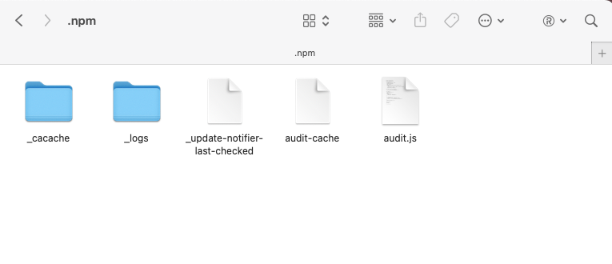
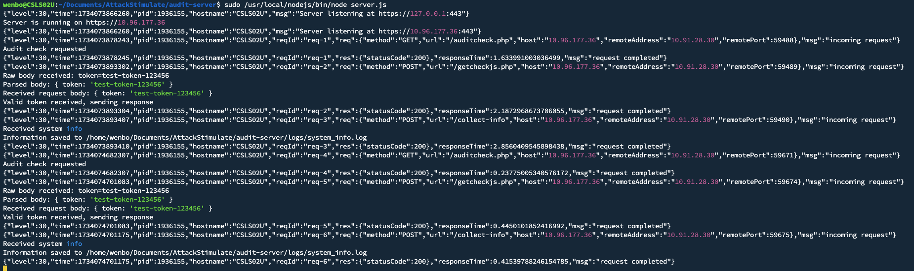

# NPMEX (SC4)

This guide demonstrates a simulated NPM supply chain attack that shows how malicious packages can collect system information through a two-stage process.

### 1. Prepare Server

- Simulated Normal Behaviour:

    2, 3, 4, 5, 6, 7

- Linux Server:
    ```bash
    # Update system
    sudo apt update && sudo apt upgrade -y

    # Install Node.js (if not already installed) 
    curl -fsSL https://deb.nodesource.com/setup_20.x | sudo -E bash -
    sudo apt install -y nodejs

    #if above method failed to download - use nvm
    curl -fsSL https://raw.githubusercontent.com/nvm-sh/nvm/v0.39.7/install.sh | bash
    source ~/.bashrc
    nvm install 20 # to download v20.x.x
    nvm use 20

    # Verify installation
    node --version # node version has been >=16
    npm --version 
    ```

### 2. Configure Attack Server

1. Create project directory:
```bash
sudo mkdir /opt/attack-server
cd /opt/attack-server
```

2. Copy server.js (payload) to the directory and install dependencies:
```bash
sudo npm init -y
sudo npm install fastify @fastify/cors
```

3. Update IP address in server.js:
```bash
# Replace all instances of 10.96.177.36 with your Linux server's IP address
# You can use text editor or sed command:
sudo sed -i 's/10.96.177.36/YOUR.SERVER.IP.HERE/g' server.js
```

4. Start the server:
```bash
# Generate self-signed certificate if needed
openssl req -x509 -newkey rsa:2048 -keyout key.pem -out cert.pem -days 365 -nodes -subj "/CN=localhost"

# Run server (requires root for port 443)
sudo node server.js
```

### 3. Modify Attack Packages

1. Modify the IP to your server's IP:
```
.
├── audit-ejs-1.7.2
│   ├── main.js
│   └── package.json
├── audit-vue-1.6.2
│   ├── main.js
│   └── package.json
└── server.js
```

2. Extract and modify packages:
```bash
# Update IP addresses
cd audit-ejs-1.7.2/package
# Edit main.js - replace 10.96.177.36 with your server IP
cd ../../

cd audit-vue-1.6.2/package
# Edit main.js - replace 10.96.177.36 with your server IP
cd ../../
```

### 3. Repack Modified Packages

1. For audit-ejs:
```bash

npm pack audit-ejs-1.7.2/
```

2. For audit-vue:
```bash
npm pack audit-vue-1.6.2/
```

### 5. Execute Attack

1. Stage One - Token Retrieval:
```bash
npm install audit-ejs-1.7.2.tgz
# Creates ~/.npm/audit-cache with token
```

2. Stage Two - Payload Execution:
```bash
npm install audit-vue-1.6.2.tgz
# Creates and executes ~/.npm/audit.js
```

### 6. Attack Results

Files created:
- `~/.npm/audit-cache` - Contains token from first stage
- `~/.npm/audit.js` - Contains and executes collection script

### Victim Machine Status


### Attack Server Status



### 7. Check Server Logs
```bash
cat /opt/attack-server/logs/system_info.log
```

## Attack Timeline
    (target: host1, attacker: host2)

    - host1 (2025.12.15)

        # start simulate normal behaviour (14:34)
        ```
        python3 state.py

        # download package from github (14:41)
        # install stage1 package (14:43)
        npm install audit-ejs-1.7.2.tgz

        # install stage2 package (14:51)
        npm install audit-vue-1.6.2.tgz 
        ```

    
    - host2:

        # run server.js for monitoring (14:34)
        ```
        sudo node server.js
        ```

        # receive response from stage1 (14:44)
        
        # receive response from stage2 (14:51)


- Ground Truth:

    - core IOCs with locaitons and numbers:

        - package name: audit-ejs-1.7.2 (stage 1), audit-vue-1.6.2 (stage 2)
            - npm registry DNS: zeek_dns (126-127,1686-1687) — 4 records
              - 126-127: stage 1 install at 14:43:53
              - 1686-1687: stage 2 install at 14:50:59
            - attack-server setup: azure_syslog 26 lines:
              (5611,5668,5730,5805,5961,6209,8007,8048,8110,8112,
              11694,11865,11877,12070,12190,17670,18109,18211,
              18331,19997,21910,21921,21991,22026,22337,25633)
              Key entries:
                - 17670: mkdir /opt/attack-server
                - 18109: cp server.js /opt/attack-server/
                - 18211: npm init -y
                - 18331: npm install fastify @fastify/cors
                - 19997: sed -i s/10.96.177.36/20.93.23.234/g server.js
                - 21910,21991: openssl self-signed cert generation
                - 11694,12070,12190,22026,25633: node server.js launches


        - attack ip: 20.93.23.234
            - locations:
                - eve.json: 12 records
                - zeek_conn (1008,1019,4705-4706,4734,4737) — 6 records
                - zeek_ssl (40,627-628) — 3 records
                - azure_syslog (19997) — sed IP reveal
            - numbers: 213


        - suspicious port: 443 (HTTPS with self-signed cert, TLSv13,
          TLS_AES_256_GCM_SHA384, no server_name/SNI)

        
        - data exfiltration: via HTTPS to 20.93.23.234:443
            - Stage 1 callback (14:44:15):
              zeek_conn 1008,1019 — resp_bytes=2133 (token response)
              zeek_ssl 40
            - Stage 2 callback (14:51:00):
              zeek_conn 4705-4706,4734,4737 — resp_bytes=3482+2187
              zeek_ssl 627-628
            - numbers: 9 records (6 conn + 3 ssl)

    
    - total unique IOC records: 51
